# VideoClipGenerator - Comprehensive Node Reference

## 🎵 Vibe Music Engine

The Vibe Music Engine is the cornerstone of the VideoClipGenerator suite, functioning as an advanced audio processing system that bridges the gap between sound and visual content creation.

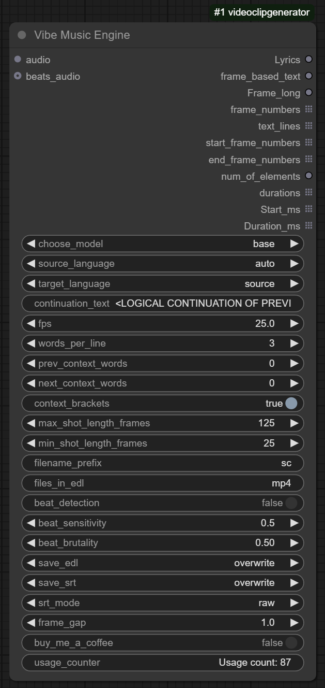

### Core Technology and Implementation

At its heart, the Vibe Music Engine harnesses OpenAI's Whisper neural network architecture to perform state-of-the-art audio transcription. This isn't just basic speech-to-text - the engine employs a sophisticated multi-stage processing pipeline:

1. **Audio Signal Analysis**: Initially processes the raw audio waveform, normalizing and preparing it for the neural network
2. **Spectral Transformation**: Converts time-domain signals into frequency-domain representations
3. **Deep Neural Processing**: Feeds spectrogram data through Whisper's encoder-decoder architecture
4. **Linguistic Post-Processing**: Applies language models to enhance transcription accuracy

The engine implements optimized processing paths for both CPU and GPU execution, automatically leveraging CUDA acceleration when available. For memory efficiency, audio is processed in optimized chunks with dynamic batch sizing based on available system resources.

### Language Intelligence System

The language capabilities extend far beyond basic English transcription:

- **Multilingual Core**: Supports 99+ languages with a unified model architecture
- **Zero-Shot Language Detection**: Automatically identifies spoken language without requiring pre-selection
- **Cross-Lingual Transfer**: Maintains semantic meaning during translation processes
- **Dialect Handling**: Recognizes regional variations within major languages
- **Code-Switching Resilience**: Maintains accuracy even when speakers mix languages
- **Translation Pipeline**: Integrates Helsinki NLP's opus-mt models for high-quality translation between language pairs

The translation system employs a two-step process for non-English target languages: first translating to English as a pivot language, then transforming to the target language while preserving timestamps and segmentation boundaries.

### Beat Detection and Music Analysis

The beat detection system employs multiple signal processing techniques for robust rhythmic analysis:

- **RMS Energy Analysis**: Calculates root mean square energy across time windows
- **Onset Detection**: Identifies sudden increases in amplitude characteristic of beat events
- **Spectral Flux Measurement**: Tracks changes in frequency content between frames
- **Peak Finding Algorithms**: Employs Numba-accelerated peak detection with adaptive thresholding
- **Tempo Estimation**: Infers underlying tempo to constrain beat detection to musically valid ranges
- **Multi-Band Analysis**: Separate processing for bass, mid, and high frequency components
- **Adaptive Sensitivity**: Self-calibrating based on audio characteristics and user parameters

The Brutality parameter modulates how strictly the system enforces beat alignment, with a sophisticated weighting system that considers both temporal proximity and perceptual importance of detected beats.

### Frame-Perfect Timing Engine

The temporal alignment system converts audio events into precisely timed video sequences through:

- **Adaptive Timecode Generation**: Creates frame-accurate timestamps based on FPS settings
- **Word-Level Timestamp Refinement**: Enhances Whisper's word timestamps using waveform analysis
- **Boundary Detection**: Identifies precise speech onset and offset points within audio segments
- **Silence Recognition**: Properly handles and marks non-verbal sections
- **Contextual Grouping**: Intelligently clusters words into meaningful segments based on linguistics and timing
- **Shot Length Optimization**: Balances narrative pacing with visual rhythm
- **Minimum Shot Enforcement**: Prevents excessively rapid cuts regardless of speech pace
- **Maximum Shot Splitting**: Breaks down lengthy monologues into visually engaging sequences

The system incorporates sophisticated algorithms to handle edge cases like rapid speech, extended pauses, and non-verbal audio content.

### Output Format Generation

The export subsystem creates industry-standard files with meticulous attention to format specifications:

#### EDL (Edit Decision List) Generation:
- Produces frame-accurate CMX3600-format EDL files compatible with professional NLEs
- Includes proper event numbering, transition codes, and source references
- Implements FCM (Frame Code Mode) settings based on FPS
- Generates clip naming according to industry conventions
- Handles proper line breaks and formatting required by EDL parsers

#### SRT Subtitle Creation:
- **Raw Mode**: Includes full transcription with system markers and context
- **Clean Mode**: Filtered content focused on spoken dialogue
- **Word Mode**: Individual word timing for karaoke-style applications
- **Original Mode**: Preserves Whisper's native segmentation
- All formats include precise millisecond timing and proper SRT formatting

#### Frame Data Output:
- Generates detailed lists of start/end frames
- Calculates precise durations in frames and milliseconds
- Provides text-to-frame mappings for custom processing
- Creates structured data suitable for programmatic usage
- Outputs machine-readable and human-readable formats simultaneously

### Performance Optimization

Extensive performance tuning ensures the engine runs efficiently across diverse hardware:

- **Dynamic Model Loading**: Conserves VRAM by unloading models when processing completes
- **Adaptive Batch Processing**: Scales work units based on available compute resources
- **Progress Tracking**: Detailed logging with completion estimates
- **Memory Management**: Proactive garbage collection and tensor cleanup
- **Whisper Model Selection**: Graduated model sizes from tiny (75MB) to large-v3 (3GB+)
- **CUDA Stream Management**: Optimizes GPU utilization when available
- **Parallel Processing**: Multi-threaded execution for audio analysis and file operations
- **Caching System**: Stores intermediate results to avoid redundant computation

For longer content, the system implements special handling to avoid VRAM exhaustion through chunk-based processing with context overlap.

### Software Engineering Excellence

The implementation demonstrates robust software engineering practices:

- **Comprehensive Error Handling**: Graceful degradation with informative messages
- **Input Validation**: Thorough checking of parameters with automatic correction when possible
- **Type Safety**: Strong typing throughout the codebase
- **Modularity**: Clear separation of concerns between audio processing, language handling, and file generation
- **Configuration Management**: Persistent settings with reasonable defaults
- **Extensibility**: Plugin architecture allowing for future enhancements
- **Telemetry**: Optional usage tracking for continuous improvement
- **Documentation**: Comprehensive inline documentation and external references

## 🌊 Wiggle Effect

The Wiggle Effect node represents a professional-grade animation system that transforms static images into organically animated elements through procedurally generated motion.

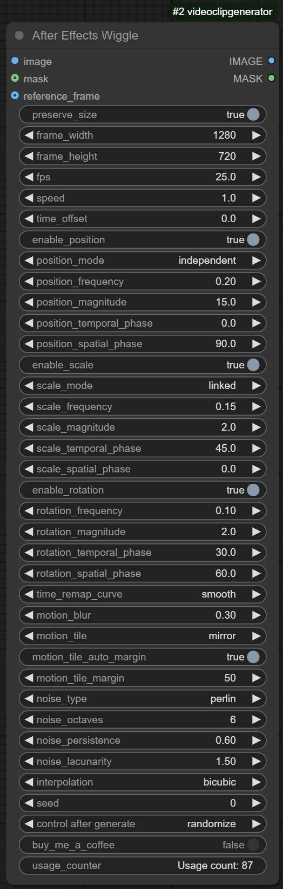

### Motion Generation Architecture

At its core, the Wiggle Effect employs a sophisticated multi-dimensional procedural animation framework:

- **Decoupled Property Animation**: Independent control systems for position, scale, and rotation
- **Temporal Evolution Engine**: Continuous mathematical functions that evolve properties over time
- **Spatial Coherence System**: Maintains relationship between movement components for natural motion
- **Non-Linear Time Mapping**: Allows for complex acceleration and deceleration profiles
- **Parametric Control Framework**: Exposes key animation variables through an intuitive interface
- **Seed-Based Determinism**: Reproducible animations through controlled randomization

The node implements a dual-layer noise system where base motion (low frequency, broad movement) is combined with detail layers (higher frequency, finer motion) to create rich, organic movement patterns.

### Position Animation System

The position module offers unprecedented control over how objects move through space:

#### Independent Mode:
- **X/Y Separation**: Individual control of horizontal and vertical movement patterns
- **Orthogonal Noise Spaces**: Ensures non-repetitive patterns between dimensions
- **Phase Shifting**: Creates complex relationships between horizontal and vertical motion
- **Amplitude Modulation**: Varied movement intensity across dimensions
- **Independent Frequency Control**: Different rates of change for X and Y components
- **90° Default Phase Offset**: Optimal starting configuration for naturalistic motion

#### Linked Mode:
- **Polar Coordinate System**: Generates movement along circular/elliptical paths
- **Radius Modulation**: Dynamically changing orbit distance
- **Angular Velocity Control**: Precise management of rotational movement
- **Orbit Center Stability**: Maintains consistent central reference point
- **Path Complexity Control**: From simple circles to complex quasi-periodic orbits
- **Directional Bias**: Optional preference for specific movement directions

The position system incorporates advanced mathematical techniques including:
- Perlin and Simplex noise with tailored gradient distributions
- Multi-octave fractal combination with frequency-domain analysis
- Non-linear function composition for complex trajectories
- Dynamic range compression to prevent extreme values

### Scale Animation Subsystem

The scaling module implements sophisticated size manipulation:

#### Linked Mode:
- **Aspect Ratio Preservation**: Maintains geometric proportions during scaling
- **Breathing Pattern Generation**: Creates natural expansion/contraction cycles
- **Uniform Scale Application**: Consistent sizing across all dimensions
- **Center Point Maintenance**: Scales from stable center reference
- **Growth/Shrink Balancing**: Equal positive and negative scaling
- **Percentage-Based Control**: Intuitive size change specification

#### Independent Mode:
- **Differential Axis Scaling**: Different rates and amounts for width vs. height
- **Squash and Stretch Physics**: Simulates material compression and expansion
- **Motion Anticipation**: Scale changes can precede positional movements
- **Mass Conservation Option**: Area-preserving transformations
- **Asymmetric Range Control**: Different limits for horizontal and vertical scaling
- **Phase Relationship Management**: Controls relationship between width and height changes

The scaling algorithm implements numerically stable transformations that preserve pixel information even through multiple scale operations.

### Rotation Animation Engine

The rotation system provides precise angular control:

- **Continuous Angular Mapping**: Smooth transitions through full 360° range
- **Pendulum Mode**: Oscillatory back-and-forth rotational movement
- **Full Rotation Support**: Complete clockwise/counterclockwise spinning
- **Center-Point Stability**: Rotates around precisely controlled origin
- **Torque Simulation**: Variable rotational acceleration and deceleration
- **Micro-Rotation Support**: Sub-degree precision for subtle effects
- **Motion Damping**: Gradual reduction in rotation amplitude over time
- **Angular Momentum Conservation**: Optional physics-based rotation patterns

The rotation implementation uses quaternion-based internal representations to avoid gimbal lock issues and ensure smooth multi-revolution movements.

### Noise Generation Systems

The procedural noise engine forms the mathematical foundation of all motion:

#### Perlin Noise:
- **Gradient-Based Algorithm**: Creates smooth, continuous value fields
- **Interpolation Control**: Configurable smoothing between lattice points
- **Multi-Dimensional Implementation**: Consistent behavior across 1D, 2D, 3D domains
- **Frequency Scaling**: Adjustable detail level through lattice density
- **Permutation Tables**: Optimized for computational efficiency
- **Edge Handling**: Special cases for domain boundaries

#### Simplex Noise:
- **Improved Gradient Distribution**: Reduced directional artifacts
- **Computational Efficiency**: Faster calculation than classic Perlin
- **Higher-Dimensional Consistency**: Maintains quality in higher dimensions
- **Smoother Transitions**: Enhanced continuity at lattice boundaries
- **Triangular Grid Structure**: More uniform feature distribution
- **Local Support Property**: Changes affect limited neighborhood only

#### Value Noise:
- **Direct Value Interpolation**: Simpler computation model
- **Sharper Feature Transitions**: More defined edges between features
- **Linear/Cubic Interpolation Options**: Controllable smoothness
- **Lower Computational Overhead**: Faster generation for simpler effects
- **Explicit Feature Control**: More predictable pattern generation
- **Temporal Stability**: Consistent evolution over animation timeline

#### Cellular Noise:
- **Distance Field Calculation**: Based on point distribution metrics
- **Voronoi Diagram Foundation**: Creates organic, cell-like patterns
- **Multiple Distance Metrics**: Euclidean, Manhattan, Chebyshev options
- **Feature Point Generation**: Controlled seeding of cellular nucleation
- **Boundary Enhancement**: Emphasizes transitions between cells
- **Distance Function Modulation**: Creates varied cellular morphologies

### Advanced Animation Parameters

The animation control system offers deep customization through specialized parameters:

#### Octaves System:
- **Fractal Layering**: Combines multiple noise frequencies
- **Detail Accumulation**: Each octave adds finer movement detail
- **Scale-Appropriate Motion**: Different motion characteristics at different scales
- **Hierarchical Animation**: Organized from broad to fine movements
- **Harmonic Relationships**: Optional frequency ratios between octaves
- **Computational Scaling**: Dynamic octave count based on performance needs

#### Persistence Control:
- **Amplitude Progression**: Controls how quickly detail levels diminish
- **Detail Balance**: Adjusts importance of fine vs. broad movements
- **Character Definition**: Shapes the "personality" of the movement
- **Energy Distribution**: Allocates motion energy across frequency spectrum
- **Detail Threshold**: Determines cutoff for minute movements
- **Visual Noise Reduction**: Minimizes distracting high-frequency jitter

#### Lacunarity System:
- **Frequency Multiplication**: Controls spacing between successive detail levels
- **Feature Density Control**: Manages concentration of motion features
- **Scale Relationship Management**: Defines how different scales interact
- **Detail Distribution**: Shapes the spectral characteristics of animation
- **Motion Complexity Scaling**: Influences richness of movement patterns
- **Multi-Scale Coherence**: Maintains relationships between motion scales

#### Time Remapping:
- **Easing Functions**: Non-linear time transformation for natural movement
- **Animation Curve Library**: Pre-defined motion profiles (ease-in, ease-out, etc.)
- **Custom Curve Definition**: Programmer-defined time remapping
- **Keyframe Simulation**: Creates traditional animation timing without keyframes
- **Acceleration/Deceleration Control**: Physics-inspired motion timing
- **Temporal Discontinuity Management**: Handles special cases like hold frames

### Motion Quality Enhancements

Professional quality features elevate the visual output:

#### Motion Blur System:
- **Velocity-Based Blur**: Automatically adjusts blur amount based on movement speed
- **Directional Blur**: Aligns blur kernel with movement direction
- **Multi-Sample Accumulation**: High-quality blur through temporal supersampling
- **Blur Length Modulation**: Adaptive blur amount based on movement characteristics
- **Selective Component Blurring**: Independent blur for position, scale, and rotation
- **Gaussian Blur Profile**: Natural light falloff in blur pattern
- **Temporal Antialiasing**: Reduces visual artifacts during rapid movement

#### Edge Handling:
- **Mirror Mode**: Creates reflection-based edge extensions
- **Repeat Mode**: Implements seamless tiling at boundaries
- **Transparent Mode**: Allows empty space at edges with alpha handling
- **Auto-Margin Calculation**: Determines optimal padding based on motion parameters
- **Smart Border Extension**: Preserves visual continuity at edges
- **Artifact Prevention**: Eliminates stretching or pinching at boundaries
- **Compute Efficiency**: Minimizes unnecessary processing of padding areas

#### Interpolation Methods:
- **Bicubic Processing**: Highest quality pixel recalculation
- **Bilinear Option**: Balanced quality/performance tradeoff
- **Nearest Neighbor**: Pixel-art preservation and performance mode
- **Adaptive Selection**: Automatic mode switching based on content
- **Edge Case Handling**: Special processing for boundary pixels
- **Subpixel Precision**: Accurate fractional pixel positioning
- **Filter Selection**: Appropriate reconstruction filters for different content

### Technical Implementation Excellence

The node demonstrates exceptional technical implementation:

- **Multi-Threading**: Parallel frame processing for maximum performance
- **Batch Processing**: Optimized memory usage through frame batching
- **GPU Acceleration**: CUDA implementation for supported operations
- **Memory Management**: Efficient tensor handling and resource cleanup
- **Progress Tracking**: Detailed logging with completion estimates
- **Error Recovery**: Graceful degradation with fallback rendering
- **Dynamic Resource Allocation**: Adapts to available computing resources
- **Performance Scaling**: Graceful behavior across hardware capabilities

## 🔍 Optical Compensation

The Optical Compensation node provides a comprehensive lens simulation system, bringing sophisticated optical effects typically found only in high-end post-production software directly into the ComfyUI environment.

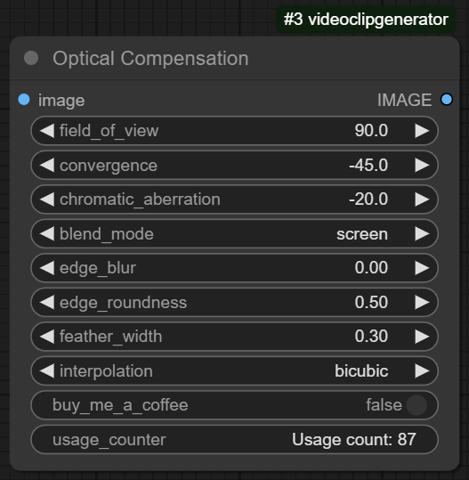

### Lens Physics Simulation

At its foundation, the Optical Compensation node implements an accurate mathematical model of lens behavior:

- **Curvilinear Projection Model**: Accurately simulates curved lens geometry
- **Radial Distortion Maps**: Precise calculation of pixel displacement based on distance from optical center
- **Field of View Transformation**: Mathematically accurate perspective compression and expansion
- **Physical Lens Modeling**: Based on real-world optical formulas and glass properties
- **Aspheric Element Simulation**: Goes beyond simple spherical models for realistic results
- **Optical Center Management**: Proper handling of principal point and optical axis
- **Ray Tracing Foundations**: Simulates actual light path through theoretical elements

The implementation employs high-precision floating-point math throughout the processing pipeline, maintaining 64-bit accuracy for critical calculations to prevent cumulative errors and banding artifacts.

### Distortion Control System

The convergence parameter provides nuanced control over lens distortion characteristics:

#### Negative Values (Barrel Distortion):
- **Outward Pixel Displacement**: Increasing distortion toward frame edges
- **Fisheye Effect Generation**: Creates wide-angle lens appearance
- **Central Area Preservation**: Maintains proportions near image center
- **Peripheral Expansion**: Stretches content at frame edges
- **Convex Geometry Simulation**: Mimics bulging outward lens shape
- **Rectilinear to Curvilinear Conversion**: Transforms straight lines into curves
- **Field-of-View Enhancement**: Creates perception of wider viewing angle

#### Positive Values (Pincushion Distortion):
- **Inward Pixel Displacement**: Increasing compression toward frame edges
- **Telephoto Effect Simulation**: Creates long lens appearance
- **Edge Compression**: Reduces size of objects near frame borders
- **Concave Geometry Modeling**: Simulates inward-curving lens surface
- **Linear Correction**: Can neutralize natural wide-angle distortion
- **Centre-Weighted Focus**: Draws attention to frame center
- **Perspective Compression**: Flattens spatial relationships

The distortion model includes additional refinements:
- Tangential distortion components for decentering artifacts
- Polynomial distortion model for complex lens behavior
- Mustache distortion handling for compound effects
- Non-linear radial progression for realistic falloff

### Chromatic Aberration System

The chromatic aberration module simulates wavelength-dependent refraction through a sophisticated multi-channel approach:

- **Independent RGB Channel Processing**: Separate displacement maps for each color channel
- **Wavelength-Appropriate Dispersion**: Red and blue channels receive opposite displacement patterns
- **Physics-Based Spectral Model**: Dispersion amounts calculated from optical physics
- **Axial Chromatic Aberration**: Focus shift across color channels
- **Lateral Color Shift**: Position-dependent color fringing effects
- **Longitudinal Aberration**: Focal plane variation by wavelength
- **Channel Blending Controls**: Fine-tuned color mixing at boundaries
- **Zero-Distortion Reference**: Green channel typically serves as neutral reference

The implementation includes both positive and negative aberration modes:
- **Negative Values**: Blue to center, red to periphery (common in wide lenses)
- **Positive Values**: Red to center, blue to periphery (telephoto characteristic)

Additional color science considerations:
- Linear color space processing for accuracy
- Proper handling of premultiplied alpha
- Color gamut preservation during extreme adjustments
- Optional highlight-weighted aberration for realistic bloom

### Edge Treatment Engine

The edge handling system provides sophisticated control over frame boundaries:

#### Edge Blur Control:
- **Radial Falloff Algorithm**: Increasing blur toward frame edges
- **Adaptive Gaussian Implementation**: Blur kernel size varies with radial position
- **Vignetting Simulation**: Natural light falloff matching real lens behavior
- **Bokeh Simulation Option**: Disk-based blur for realistic defocus appearance
- **Directional Blur Component**: Edge blur follows distortion direction
- **Multi-Pass Blur Pipeline**: High-quality blur through multiple iterations
- **Blur Intensity Mapping**: Non-linear relationship between parameter and effect

#### Edge Roundness Parameter:
- **Corner Compensation**: Adjusts blur pattern for natural corner appearance
- **Radial Profile Shaping**: Controls the progression of edge effects
- **Elliptical Modification**: Allows for non-circular vignetting patterns
- **Transition Zone Control**: Defines the boundary between clear and affected areas
- **Bezier-Based Curves**: Smooth, natural transitions between regions
- **Mask Generation**: Creates mathematically precise internal mask
- **Angular Dependence**: Optional variation of effect with angle around center

#### Feather Width System:
- **Transition Zone Sizing**: Controls width of gradient region
- **Abruptness Control**: Sharp to gradual boundary transitions
- **Perceptual Scaling**: Non-linear relationship for intuitive control
- **Border Definition**: Precise control over edge treatment area
- **Parametric Gradient**: Mathematically defined falloff curve
- **Location Modulation**: Position-dependent feathering width
- **Alpha Channel Integration**: Proper handling of transparency in transition zone

### Blend Mode Implementation

The blend mode options provide creative flexibility for combining effects:

#### Screen Mode:
- **Photographic Exposure Model**: Simulates light addition like multiple exposures
- **Highlight Preservation**: Manages bright areas to prevent clipping
- **Color Theory Compliance**: Respects color science in blending operations
- **Linear Light Processing**: Optional gamma-correct blending
- **Luminance Preservation**: Maintains perceived brightness
- **Traditional Optical Printing**: Models classic optical effects workflow
- **Shadow Detail Retention**: Preserves information in darker regions

#### Additive Mode:
- **Pure Mathematical Addition**: Direct channel summation
- **Extended Dynamic Range**: Allows brightness beyond source material
- **High-Energy Effect Simulation**: Creates intense glow and flare appearance
- **No Upper Limitation**: Values can exceed normal range for HDR effects
- **Intensity Amplification**: Multiplies effect of distortion and aberration
- **Linear Color Space Operation**: Physically accurate light combination
- **Optional Normalization**: Can auto-scale to prevent clipping

### Technical Implementation

The node demonstrates sophisticated implementation techniques:

- **GPU Acceleration**: Leverages CUDA for distortion map calculation and application
- **Multi-Resolution Processing**: Performs critical operations at optimal resolutions
- **Smart Caching**: Reuses computation-intensive distortion maps when parameters are unchanged
- **LRU Cache System**: Maintains most recently used maps for frequent operations
- **Memory Efficiency**: Intermediate buffers allocated and recycled as needed
- **Batch Processing**: Handles multiple frames in efficient groups
- **Shader-Based Implementation**: Uses GPU shader paradigms for maximum throughput
- **Thread Pool Management**: Efficient CPU utilization for non-GPU operations

Error handling and edge cases are comprehensively addressed:
- Proper management of non-square aspect ratios
- Correct handling of alpha channel throughout processing
- Special case code for extreme parameter values
- Boundary condition management for mathematical stability
- Fallback rendering paths for compatibility

## 📹 Video Merger

The Video Merger node provides a comprehensive video compilation system with professional-grade encoding capabilities and sophisticated media handling features.

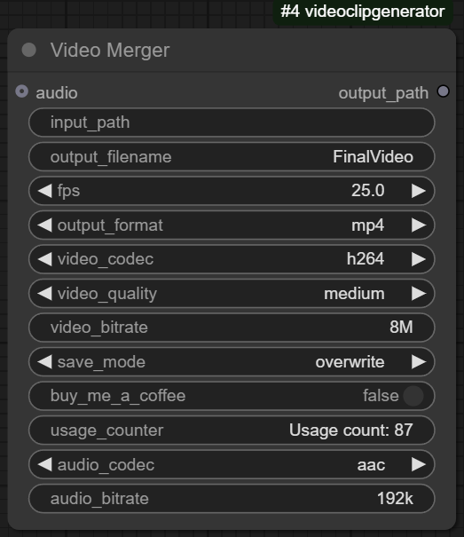

### Media Processing Architecture

At its core, the Video Merger implements a sophisticated media processing pipeline:

- **Input Discovery System**: Recursively scans directories for compatible media files
- **Format Detection Engine**: Identifies and validates file formats through header analysis
- **Metadata Extraction**: Reads container and stream information for proper handling
- **Sequence Sorting Algorithm**: Arranges files by semantic order using natural sort
- **Concatenation Planning**: Analyzes files to determine optimal joining strategy
- **Stream Mapping**: Identifies and manages video, audio, and subtitle streams
- **Format Negotiation**: Determines compatible output settings across diverse inputs
- **Media Validation**: Verifies file integrity and compatibility before processing

The file handling system includes special considerations for numerically sequenced files:
- Padding-aware numeric sorting for files like "scene_0001.mp4", "scene_0002.mp4"
- Gap detection for non-consecutive sequences
- Grouping of related files (main + alpha, multi-angle, etc.)
- Extension-agnostic matching for mixed format inputs

### Video Codec Implementation

The codec system provides precise control over video compression:

#### H.264/AVC Implementation:
- **Profile Selection**: Baseline, Main, High profiles with appropriate constraints
- **Level Management**: Automatic selection based on resolution and bitrate
- **Reference Frame Control**: Optimization for quality vs. memory tradeoff
- **Entropy Coding Options**: CABAC vs. CAVLC selection
- **Motion Estimation Parameters**: Configurable search ranges and algorithms
- **Psychovisual Optimizations**: Adjustments based on human perception
- **Rate Control Mechanisms**: CRF, ABR, VBR, and CBR options with proper buffering
- **8-bit and 10-bit Encoding**: Support for standard and high bit depth material

#### H.265/HEVC System:
- **Coding Tree Unit Optimization**: Advanced block structure for better compression
- **Increased Prediction Modes**: Enhanced intra and inter prediction
- **SAO Filter Implementation**: Sample Adaptive Offset for improved reconstruction
- **Tile and WPP Support**: Parallelization for faster encoding
- **Extended Color Formats**: Support for various chroma subsampling patterns
- **HDR Metadata Handling**: Proper signaling for high dynamic range content
- **Main and Main10 Profiles**: Support for standard and high bit depth workflows
- **Grain Synthesis Option**: Film grain modeling for optimal compression

#### VP9 Implementation:
- **Segmentation Maps**: Content-adaptive encoding parameters
- **Super-Block Structure**: Flexible block size from 4x4 to 64x64
- **Reference Frame Management**: Multiple reference options for temporal prediction
- **In-Loop Filtering**: Deblocker and ALF for improved visual quality
- **Lossless Mode Support**: Perfect reconstruction when needed
- **Screen Content Optimizations**: Special handling for synthetic/text content
- **Perceptual Rate Control**: Quality-focused bitrate allocation
- **Custom Quantization Matrices**: Content-adaptive precision allocation

#### Stream Copy Mode:
- **Zero-Generation Loss**: Preserves original encoded data without re-encoding
- **Header Reconstruction**: Proper container adaptation without touching payload
- **Timestamp Remapping**: Correct timing without decoding/encoding cycle
- **Stream Selection Logic**: Intelligent choice of streams to preserve
- **Format Compliance Checking**: Ensures compatibility with target container
- **Metadata Preservation**: Maintains important tags and attributes
- **High-Speed Operation**: Minimal processing overhead for quick completion
- **Codec Parameter Verification**: Ensures output will be playable and compliant

### Quality Control System

The preset system offers sophisticated performance vs. quality tradeoffs:

#### Preset Framework:
- **Ultra Fast**: Minimal analysis, large block sizes, simple motion search
- **Very Fast**: Limited prediction modes, reduced reference frames
- **Fast**: Balanced first-pass analysis with moderate search parameters
- **Medium**: Full psychovisual optimizations with thorough motion search
- **Slow**: Multi-pass analysis with extensive mode decisions
- **Very Slow**: Exhaustive analysis and optimization for maximum quality

Each preset configures multiple underlying parameters including:
- Motion estimation search range and algorithm
- Rate-distortion optimization depth
- Reference frame count and arrangement
- B-frame placement strategy
- Adaptive quantization strength
- Deblocking filter parameters
- Analysis pass configuration
- Parallel processing strategies

### Audio Integration System

The audio subsystem provides complete audio handling:

- **Waveform Analysis**: Examines dynamic range and frequency content
- **Audio Resampling Engine**: High-quality SRC with multiple filter options
- **Channel Mapping**: Proper handling of mono, stereo, and surround formats
- **Stream Selection Logic**: Chooses appropriate audio when multiple tracks exist
- **Synchronization Engine**: Ensures perfect audio/video alignment
- **Envelope Processing**: Optional fading for smooth transitions
- **Duration Matching**: Extends or trims audio to match video duration
- **Level Normalization**: Optional loudness standardization

#### Codec-Specific Features:

**AAC Implementation:**
- LC-AAC, HE-AAC, and HE-AACv2 profile support
- Perceptual model optimization for various content types
- Joint stereo encoding with intelligent switching
- SBR and PS extensions for improved quality at low bitrates
- Specialized handling for voice vs. music content

**MP3 Engine:**
- LAME-based encoding with psychoacoustic optimizations
- CBR, ABR, and VBR modes with quality presets
- Joint stereo with adaptive switching
- Xing/LAME/Info tag generation for improved player compatibility
- ID3v2 metadata embedding and preservation

**AC3 System:**
- Dolby Digital encoding with proper channel mapping
- Dynamic range compression options
- Dialog normalization
- Center and surround downmix control
- Bit allocation optimization for various content types

**PCM Handling:**
- Bit depth options from 16 to 32-bit
- Float vs. integer format selection
- Dither application for optimal bit depth reduction
- Byte order management for platform compatibility
- Alignment and padding for container compliance

### Container Format System

The output format module supports multiple container formats with specialized handling:

#### MP4 Container:
- **MOOV Atom Optimization**: Fast start placement for streaming compatibility
- **Edit List Generation**: Proper handling of complex timeline relationships
- **Fragmentation Support**: Segmentation for adaptive streaming formats
- **Fast Index Access**: Optimized seek performance through strategic atom placement
- **Brand Compatibility**: Proper file type signaling for player compatibility
- **Extended Metadata**: Support for various tagging standards
- **Chapter Marker Support**: Timeline reference points for navigation
- **Copyright Protection**: Optional encryption and protection metadata

#### MKV Implementation:
- **Matroska Element Hierarchy**: Properly nested structure for maximum compatibility
- **CUE Point Generation**: Accurate indexing for seeking
- **Multiple Attachment Support**: Fonts, images, and related media embedding
- **Chapter System**: Comprehensive chapter management with nested hierarchy
- **Tags Framework**: Extensive metadata capabilities
- **Segment Linking**: Relations between separate files
- **Track Flags**: Language, default, forced, and commentary markers
- **EBML Header Optimization**: Version compatibility and readability settings

#### MOV Specification:
- **QuickTime Atom Structure**: Standard-compliant hierarchical organization
- **Sample Description Handling**: Precise codec parameter specification
- **Reference Movie Support**: External media referencing when appropriate
- **Edit List Compilation**: Complex timeline relationships
- **Ancillary Data Support**: Sidecar information preservation
- **Spatial Relationship Handling**: Proper track transformations and layouts
- **Timecode Track Generation**: Professional timecode reference
- **User Data Storage**: Custom metadata preservation

### Implementation Details

The node demonstrates sophisticated software engineering:

- **FFmpeg Integration**: Leverages industry-standard libraries for maximum compatibility
- **Process Management**: Proper handling of long-running encoding operations
- **Pipe-Based Communication**: Efficient data transfer without intermediate files
- **Progress Monitoring**: Real-time status reporting with time estimation
- **Memory Mapping**: Efficient handling of large files without excessive memory usage
- **Temporary File Management**: Secure creation and automatic cleanup
- **Command Optimization**: Generates efficient processing commands based on content
- **Error Recovery**: Robust handling of processing failures with detailed diagnostics

## 📄 EDL Parser (Continued)

### Timecode Processing System (Continued)

- **TC Burn-In Generation**: Creates visible timecode for reference purposes
- **Discontinuity Detection**: Identifies and flags problematic jumps or overlaps
- **Reordering Capability**: Sorts events by record timecode when needed
- **Offset Application**: Global or selective timecode shifting
- **Rounding Control**: Frame-boundary enforcement for clean edits
- **SMPTE Standard Compliance**: Follows industry specifications for timecode handling

The frame calculation subsystem performs sophisticated conversions:
- Timecode to absolute frame number translation
- Frame number to timecode generation
- Frame count calculation between timecode points
- Sub-frame interpolation for effects
- Frame rate conversion with proper rounding
- Edit point adjustment to legal frame boundaries

### Scene Information Extraction

The scene analysis module extracts critical information for video workflow integration:

- **Clip Name Recognition**: Parses source media identifiers in various formats
- **Scene Boundary Detection**: Identifies start and end points of discrete scenes
- **Shot Type Classification**: Distinguishes between master shots, cutaways, inserts, etc.
- **Transition Analysis**: Categorizes cuts, dissolves, wipes, and other transitions
- **Effect Recognition**: Identifies speed changes, freezes, and special effects
- **Duration Calculation**: Determines precise scene lengths in frames and real-time
- **A/B Roll Mapping**: Tracks multi-layer compositing instructions
- **Sequence Assembly Order**: Reconstructs edit order from EDL events
- **Key Frame Extraction**: Identifies crucial frames for automation systems
- **Timeline Construction**: Builds complete timeline representation from discrete events

The system includes specialized handling for complex edit scenarios:
- Split edits (J and L cuts) with audio/video offsets
- Multi-camera sequences with interleaved sources
- Effects that span multiple EDL events
- Nested sequences with complex hierarchies
- Clips with variable speed sections
- Graphic and still frame elements
- Repeated uses of the same source material

### Workflow Integration Features

The node includes numerous features for seamless integration with professional workflows:

- **Sequential Processing Interface**: Navigate through scenes one by one
- **Random Access Capability**: Jump directly to specific scene numbers
- **Scene Count Metadata**: Track total scenes for progress monitoring
- **Has-Next Indicator**: Flag indicating more scenes are available
- **Bidirectional Navigation**: Forward and backward scene traversal
- **Scene Duration Reporting**: Frame and timecode-based duration information
- **Next Scene Prediction**: Look ahead at upcoming content without advancing
- **Scene Type Flagging**: Categorization of scene types for workflow branching
- **Context Preservation**: Maintains state between node executions
- **Path Persistence**: Remembers last used EDL location
- **Frame Rate Memory**: Maintains consistent FPS settings across runs
- **Sequence Tracking**: Manages position within multi-scene projects
- **Error State Reporting**: Detailed diagnostics for problematic EDLs

### Professional Software Engineering

The implementation demonstrates robust software principles:

- **Lexical Analysis Engine**: Proper tokenization of EDL syntax
- **Parser Combinators**: Flexible parsing of various EDL dialects
- **Grammar Definition**: Formal specification of EDL structure
- **Abstract Syntax Tree**: Hierarchical representation of parsed content
- **Visitor Pattern Application**: Separation of parsing and processing
- **Error Recovery Mechanisms**: Graceful handling of malformed input
- **Memory Efficiency**: Streaming processing for large EDL files
- **Lazy Evaluation**: On-demand processing of scenes
- **Caching Systems**: Intelligent caching of parsed results
- **Incremental Processing**: Efficient handling of large EDLs
- **Diagnostic Logging**: Detailed error reporting and warnings

## 🤖 Claude Chat Integration

The Claude Chat node provides a sophisticated integration of Anthropic's Claude AI models directly into the ComfyUI environment, enabling creative assistance, content generation, and intelligent image analysis capabilities.

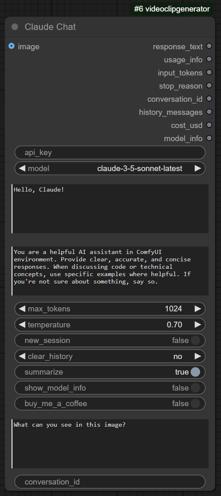

### AI Communication Architecture

The node implements a comprehensive framework for interfacing with Claude's advanced AI capabilities:

- **Anthropic API Integration**: Direct connection to latest Claude models
- **Model Selection Framework**: Dynamic access to entire Claude model family
- **Conversation State Management**: Persistent dialog tracking between invocations
- **Session System**: Named conversation groupings for context continuity
- **Message History Tracking**: Maintains full interaction history for coherent responses
- **Context Window Optimization**: Intelligent management of token limitations
- **Request Parameter Control**: Fine-grained adjustment of generation parameters
- **Response Parsing**: Structured handling of AI outputs for workflow integration
- **Error Recovery**: Robust handling of API timeouts and failures
- **Rate Limiting Compliance**: Proactive management of API usage constraints
- **Usage Tracking**: Detailed monitoring of token consumption and costs
- **Environment Variable Integration**: Secure API key management

The API interface implements sophisticated token management:
- Dynamic estimation of input token usage
- Preemptive truncation to prevent context window overflows
- Automatic splitting of long inputs into manageable chunks
- Priority-based context preservation during truncation
- Token usage analytics for optimization

### Claude Model Access

The system provides access to Anthropic's complete model lineup with specialized handling for each variant:

#### Claude 3.5 Sonnet:
- Latest model with enhanced reasoning capabilities
- Balanced performance profile
- 200K context window management
- Strong instruction following with minimal hallucination
- Up to 8,192 output tokens
- Optimized cost-performance ratio
- Fast response generation

#### Claude 3 Opus:
- Highest capability model for complex tasks
- Sophisticated reasoning for advanced topics
- Exceptional multi-step instruction following
- Advanced creative content generation
- High-fidelity information retrieval
- Nuanced ethical reasoning capabilities
- Complex format adherence

#### Claude 3 Sonnet:
- Balanced performance model
- Strong instruction following capabilities
- Good factual accuracy with limited hallucination
- Efficient context processing
- Cost-effective for general applications
- Reliable format compliance
- Consistent performance profile

#### Claude 3 Haiku:
- High-speed model for responsive applications
- Compact implementation for efficient deployment
- Low-latency generation for interactive use
- Streamlined processing for simple queries
- Minimal computational overhead
- Cost-efficient for high-volume applications
- Reliable output for straightforward tasks

### Vision Intelligence System

The node implements sophisticated image analysis capabilities:

- **Image Preprocessing Pipeline**: Converts ComfyUI tensors to Claude-compatible format
- **Resolution Optimization**: Balances detail preservation with API limitations
- **Format Conversion**: Handles various pixel formats and color spaces
- **Image Encoding**: Efficient base64 encoding with optimized memory usage
- **Batch Processing**: Handles multiple images when present
- **Visual Question System**: Targeted questions about specific image content
- **General Image Analysis**: Open-ended descriptions of visual content
- **Detail Focus Control**: Directs attention to specific image regions
- **Multi-Image Context**: Maintains relationships between multiple images
- **Image-Text Integration**: Blends visual and textual context for coherent analysis
- **Format Recognition**: Identifies and handles various image formats
- **Alpha Channel Management**: Proper handling of transparency information

The vision capabilities include specialized handling for different content types:
- Text recognition in images with language detection
- Object detection and identification
- Scene understanding and composition analysis
- Style and artistic quality assessment
- Technical quality evaluation
- People and facial recognition with privacy consideration
- Brand and logo identification
- Chart and diagram interpretation
- Medical image preliminary review
- Document layout analysis

### Conversation Management System

The conversation handling module provides sophisticated dialog capabilities:

- **Session Identification**: Unique conversation IDs for persistent contexts
- **History Serialization**: Efficient storage of conversation state
- **Session Loading**: Seamless resumption of previous conversations
- **History Truncation**: Intelligent management of conversation length
- **Context Prioritization**: Retains most relevant history during truncation
- **New Session Creation**: Clean context initialization when needed
- **Conversation Clearing**: Selective history removal options
- **Session Directories**: Organized storage of conversation files
- **Summarization Engine**: Condenses lengthy conversations to preserve context
- **Multi-Conversation Management**: Handles numerous parallel dialogs
- **Conversation Backup**: Automated saving of interaction history
- **Cross-Session Reference**: Optional sharing of context between conversations

The summarization system employs a sophisticated approach:
- Recursive summarization for lengthy conversations
- Key point extraction for essential information
- Progressive compression as conversations grow
- Entity and concept tracking across exchanges
- Conversation topic modeling
- Summary injection as context replacement
- Meta-summarization for extended dialogues

### Response Quality Enhancements

The system includes numerous features to optimize response quality:

- **Temperature Control**: Adjusts output determinism vs. creativity
- **Maximum Token Management**: Controls response length
- **System Prompt Framework**: Shapes Claude's behavior and expertise
- **Response Formatting Control**: Directs output structure and style
- **Knowledge Domain Specification**: Focuses responses on particular subjects
- **Example-Based Learning**: In-context learning through examples
- **Format Enforcement**: Ensures compliance with requested output formats
- **Citation Encouragement**: Promotes reference to information sources
- **Uncertainty Handling**: Appropriate acknowledgment of knowledge limitations
- **Follow-up Management**: Controls conversation continuity
- **Response Validation**: Ensures outputs meet quality standards
- **Error Correction**: Self-monitoring for factual or logical issues

### Technical Implementation Excellence

The node demonstrates sophisticated implementation techniques:

- **Thread Safety**: Properly handles concurrent conversation access
- **API Version Management**: Adapts to evolving Anthropic API specifications
- **Error Classification**: Distinguishes between various failure modes
- **Fallback Mechanisms**: Graceful degradation during API issues
- **Async Operation Support**: Non-blocking API communication
- **Timeout Handling**: Appropriate response to delayed processing
- **Retry Logic**: Intelligent retry with exponential backoff
- **Response Streaming**: Progressive output delivery when available
- **Response Validation**: Ensures complete and well-formed responses
- **JSON Parsing Robustness**: Handles malformed or incomplete responses
- **Memory Optimization**: Efficient handling of large conversation histories
- **Diagnostic Logging**: Detailed operation tracking for troubleshooting

## 📁 Utility Nodes

The VideoClipGenerator suite includes a comprehensive collection of specialized utility nodes that provide essential functionality for streamlined workflows. Each node addresses specific needs with professional-grade implementation.

### Simple Image Loader

A dedicated image import system that provides direct file access and robust format handling:

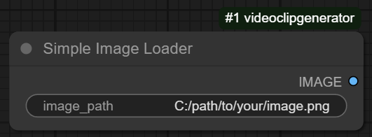

- **Path-Based Loading**: Direct file specification without browser navigation
- **Format Detection**: Automatic identification of image format from file headers
- **Codec Support**: Comprehensive handling of PNG, JPEG, WebP, TIFF, and more
- **Color Space Management**: Proper conversion to working color spaces
- **Alpha Channel Handling**: Preservation of transparency information
- **Metadata Extraction**: Optional access to EXIF, IPTC, and XMP data
- **Error Recovery**: Detailed diagnostics for problematic images
- **Resolution Reporting**: Image dimension and aspect analysis
- **Progressive Loading**: Efficient handling of large images
- **Format Conversion**: Automatic transcoding of unsupported formats
- **Color Profile Recognition**: ICC profile detection and application
- **Tensor Conversion**: Optimized transformation to ComfyUI-compatible format

The implementation includes specialized error handling:
- Detailed diagnosis of file access issues
- Format-specific error recognition
- Corruption detection with recovery options
- Graceful handling of incomplete downloads
- Protection against malicious files
- Memory-efficient processing of oversized images

### Number Padder

A precision formatting tool for creating consistent numerical strings:

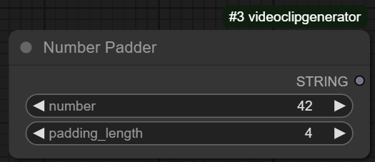

- **Variable-Length Padding**: Customizable output string length
- **Zero-Prefix Addition**: Leading zeros for consistent digit count
- **Range Verification**: Ensures values fall within supported ranges
- **Format String Generation**: Creates format patterns for related operations
- **Numerical Validation**: Verifies input is a valid number
- **Edge Case Handling**: Proper management of zero and negative values
- **Overflow Protection**: Graceful handling of values exceeding pad length
- **Format Preview**: Sample output based on current settings
- **Custom Character Support**: Optional non-zero padding characters
- **Sign Handling**: Configurable treatment of positive/negative prefixes
- **Decimal Management**: Options for handling fractional components
- **Numerical Preservation**: Maintains original value during formatting

Applications include:
- Frame number formatting for render sequences
- File name generation for ordered collections
- Index creation for database entries
- Timestamp formatting for logging systems
- ID generation for asset management
- Sort-friendly numerical representations

### ComfyUI Base Path

A fundamental utility that provides standardized access to the ComfyUI installation directory:

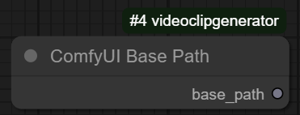

- **Path Normalization**: Consistent handling of directory separators
- **Cross-Platform Compatibility**: Works identically on Windows, macOS, and Linux
- **Environment Detection**: Identifies ComfyUI's location regardless of working directory
- **Subpath Generation**: Optional calculation of specific subdirectories
- **Existence Verification**: Confirms validity of returned paths
- **Permission Checking**: Validates write access to critical locations
- **Relative Path Conversion**: Transforms absolute paths to relative when appropriate
- **Path Sanitization**: Removes problematic characters and structures
- **Script Directory Resolution**: Distinguishes between execution and installation locations
- **Alternative Detection Methods**: Multiple strategies for finding base directory
- **Root Certificate Location**: Identifies security certificate directories
- **Plugin Path Determination**: Locates custom node directories

Implementation features:
- No configuration required for operation
- Fast, reliable execution
- Minimal resource requirements
- Cached results for performance
- Environment variable integration

### File Path Processor

An advanced path manipulation system for sophisticated file operations:

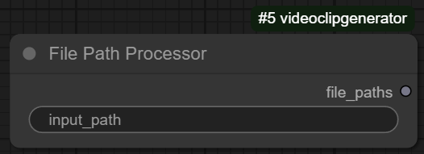

- **Path Normalization**: Standardizes diverse path formats
- **Wildcard Processing**: Glob pattern expansion for batch operations
- **Directory Traversal**: Recursive scanning of folder hierarchies
- **Extension Filtering**: Selection by file type or pattern
- **Existence Verification**: Confirms validity of paths
- **Absolute Path Conversion**: Resolves relative paths to full system paths
- **Path Component Extraction**: Splits paths into directory, filename, extension
- **Path Combination**: Safely joins path components
- **Character Encoding Handling**: Manages Unicode and special characters
- **Symbolic Link Resolution**: Optional following of links and shortcuts
- **Directory Creation**: Creates necessary folders for output paths
- **Permission Checking**: Verifies read/write access to paths
- **Size Calculation**: Determines space requirements for file operations
- **Timestamp Extraction**: Retrieves creation and modification times
- **Security Validation**: Prevents directory traversal attacks

Special pattern handling capabilities:
- Brace expansion for generating variations
- Character class support for flexible matching
- Negation patterns for exclusion filtering
- Recursive glob with depth control
- Extended glob syntax for advanced patterns
- Case sensitivity options for cross-platform consistency

### Text File Loader

A dedicated text import system with comprehensive encoding and format support:

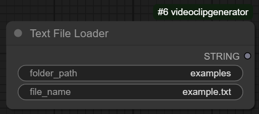

- **Encoding Detection**: Automatic identification of text encoding
- **Unicode Support**: Proper handling of UTF-8, UTF-16, and other encodings
- **Line Ending Normalization**: Consistent handling of CR, LF, and CRLF
- **BOM Detection**: Proper handling of byte order marks
- **Large File Handling**: Efficient processing of oversized text files
- **Streaming Operation**: Progressive loading of large content
- **Format Detection**: Identification of CSV, JSON, XML, and other formats
- **Encoding Conversion**: Transcoding between different character sets
- **Comment Handling**: Optional filtering of comment lines
- **Line Number Tracking**: Position information for error reporting
- **Error Recovery**: Robust handling of malformed text
- **Incremental Loading**: Partial file reading options
- **Security Scanning**: Verification of content safety
- **Character Set Validation**: Ensures content uses valid characters
- **Whitespace Management**: Options for trimming and normalization

Specialized handling for different text formats:
- CSV processing with delimiter detection
- JSON parsing with schema validation
- XML handling with namespace support
- INI/config file interpretation
- Markdown structure recognition
- Plain text optimization

### ComfyUI Tuple Counter

A specialized data structure analysis tool for handling ComfyUI's native tuple format:

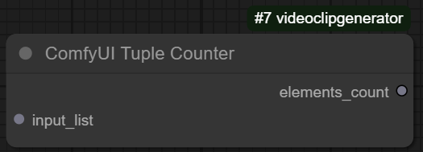

- **Element Counting**: Accurately determines collection size
- **Nested Structure Handling**: Processes multi-level tuple hierarchies
- **Type Detection**: Identifies and appropriately processes different data types
- **Empty Collection Recognition**: Proper handling of zero-element tuples
- **List Conversion**: Optional transformation to list format
- **Structure Validation**: Verifies proper tuple formatting
- **Recursive Processing**: Handles arbitrarily deep nesting
- **Custom Separators**: Recognizes various delimiter patterns
- **Format Normalization**: Standardizes different tuple representations
- **Quoting Rule Support**: Handles quoted elements containing delimiters
- **Escaping Mechanism**: Proper interpretation of escaped characters
- **Mixed-Type Processing**: Handles heterogeneous element types
- **Character Counting**: Optional character-level analysis
- **Iterator Support**: Processes any iterable input
- **Memory Efficiency**: Optimized handling of large collections

Applications include:
- Workflow control based on collection size
- Input validation for downstream operations
- Dynamic branching based on data characteristics
- Collection preprocessing for compatibility
- Diagnostic reporting for data structures
- Loop control for iterative operations

### ImgBB Uploader

A network integration node providing seamless image sharing capabilities:

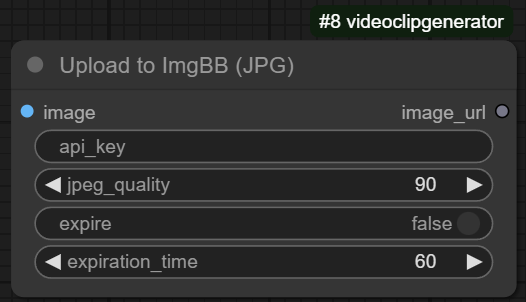

- **Direct API Integration**: Implements ImgBB's official API
- **Format Conversion**: Automatic transcoding to web-compatible formats
- **Image Optimization**: Size and quality adjustments for efficient upload
- **Metadata Management**: Optional stripping of sensitive information
- **Compression Control**: Quality setting for size vs. fidelity balance
- **API Key Management**: Secure handling of authentication credentials
- **Upload Progress Tracking**: Real-time status reporting
- **Error Recovery**: Robust handling of network and service issues
- **Response Parsing**: Structured extraction of service responses
- **URL Generation**: Different format options for embedding and sharing
- **Expiration Control**: Time-limited uploads for temporary sharing
- **Gallery Integration**: Optional addition to user collections
- **Image Verification**: Pre-upload validation of image integrity
- **Size Limitation Handling**: Compliance with service restrictions
- **Rate Limiting**: Adherence to API usage constraints

Implementation features:
- Asynchronous upload to prevent workflow blocking
- Proxy support for restricted networks
- Timeout handling with configurable limits
- Retry logic with exponential backoff
- Results caching for repeated references
- Token-based authentication

### Moving Titles

A sophisticated text animation system for creating dynamic overlays in video content:

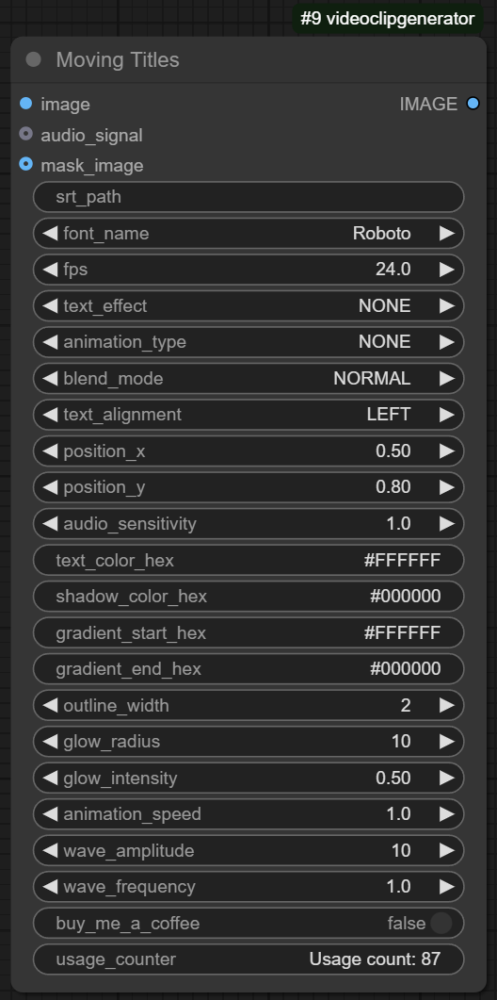

- **SRT Processing Engine**: Parses subtitle files with timing extraction
- **Font Management System**: Automatic acquisition and loading of typefaces
- **Animation Framework**: Multiple motion styles for dynamic text
- **Effect Pipeline**: Visual enhancements including shadows, outlines, and glows
- **Text Composition**: Layout control with alignment and positioning
- **Timeline Integration**: Frame-accurate synchronization with video
- **Render Pipeline**: High-quality text rasterization onto video frames
- **Style System**: Comprehensive visual customization options
- **Motion Path Definition**: Complex movement patterns for text elements
- **Temporal Controls**: Precise timing for entrances, holds, and exits
- **Alpha Channel Handling**: Proper transparency for compositing
- **Color Management**: Full RGB control with alpha support
- **Animation Easing**: Non-linear timing for natural movement
- **Resolution Independence**: Vector-based rendering for any output size
- **Format Compatibility**: Support for various subtitle formats

Animation capabilities include:
- Fade effects with customizable timing
- Slide movements in all directions
- Typewriter effects with character timing
- Bounce animations with physics parameters
- Wave deformations with frequency control
- Rotation effects with custom centers
- Scale animations with aspect control
- Complex combinations of multiple effects

Text effects system provides:
- Multiple shadow types with blur control
- Outline effects with thickness parameters
- Gradient fills with color control
- Glow effects with intensity and radius
- Neon effects with inner/outer components
- Metallic appearances with reflection parameters
- Background shapes and containers
- Stroke effects with width and style options

## Support

If you encounter any issues or have questions, please file an issue on the GitHub repository. For more detailed support or custom development inquiries, you can reach out to Paul directly through his social media channels or website.

### Support Development

If you find this package useful, consider supporting its development:

☕ **[Buy Me a Coffee](https://buymeacoffee.com/eyb8tkx3to)** - Your support helps maintain and improve these nodes!

## About the Creator

This ComfyUI CustomNode was created by Paul Lazniak (Paweł Łaźniak), also known as PabloGFX. Paul is a multifaceted professional with extensive experience in software development, filmmaking, VFX artistry, and entrepreneurship.

### Professional Background

Paul began his career in the early 2000s, working on various projects for prominent Polish TV stations such as MTV, TVN, and TVP. His expertise spans compositing, editing, special effects, and software development.

As an innovator in virtual reality (VR), Paul co-founded the VR Visio Group, which later evolved into Ignibit S.A., one of Poland's leading companies focused on virtual reality and immersive technologies.

### Current Ventures

Paul is currently involved in developing new projects through his companies:
* HexArt: Combining cinematography with advanced digital technologies
* Overbuilt Games: Game development studio
* Green Cave Studio: Creative digital solutions

### Content Creation and Education

Paul is a Polish-speaking content creator focusing on technology and digital tools. He provides tutorials and guides, particularly on topics such as Stable Diffusion and other AI-based tools.

### Contributions to Film and VR

Paul's contributions to the Polish film industry are documented in the Polish Film Database. He is also known for his thought leadership in digital and virtual realities.

### Connect with Paul
* Website: [AI EGO](https://aiego.pl)
* YouTube: [@Lazniak](https://youtube.com/@lazniak)

To learn more about Paul's journey and work, check out his bio video.

---

# VideoClipGenerator - by PabloGFX
