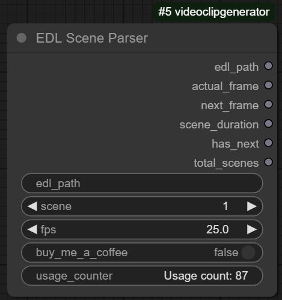
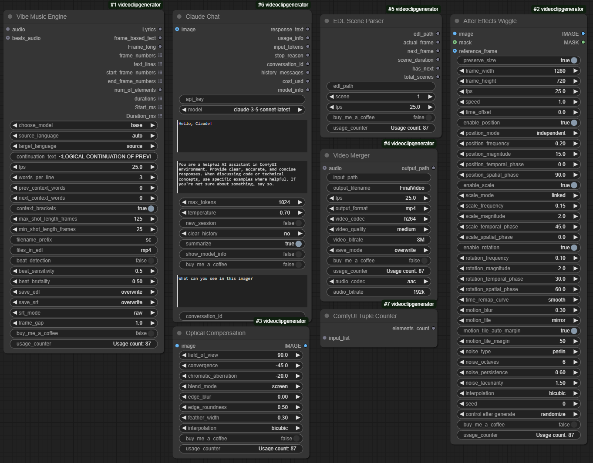
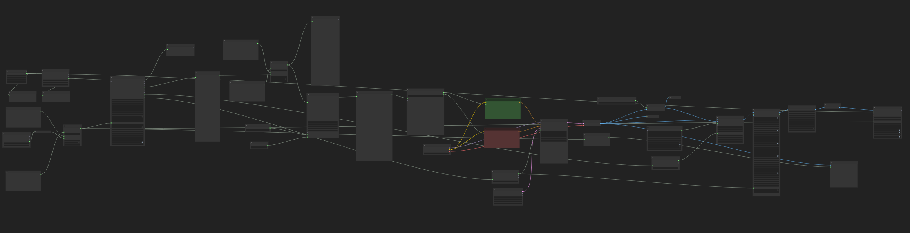

# VideoClipGenerator

<div align="center">


**Turn audio into stunning video sequences with a single click**

[](https://github.com/lazniak/videoclipgenerator/stargazers)
[](https://buymeacoffee.com/eyb8tkx3to)

</div>

## 🎬 Overview

The VideoClipGenerator is a comprehensive suite of After Effects-inspired nodes for [ComfyUI](https://github.com/comfyanonymous/ComfyUI), designed to transform your static images into dynamic video content. The flagship feature - Vibe Music Engine - analyzes audio to generate perfectly timed, professional-quality video sequences that synchronize with your vocal tracks.

Perfect for creating:
- Music videos that sync with vocals
- Social media shorts/reels
- Presentations with voiceovers
- Visual podcasts or interviews
- Any content that combines audio with visuals

This pack represents a complete workflow solution that can process audio, generate synchronized video segments, apply professional motion effects, and compile everything into a finalized video - all within ComfyUI.


## ✨ Detailed Module Descriptions

### 🎵 Vibe Music Engine

The heart of the Motion Effects Pack, Vibe Music Engine is a sophisticated audio analysis tool that converts spoken word or music into precisely timed video sequences.


**Key Capabilities:**

- **Advanced Speech-to-Text**: Leverages OpenAI's Whisper models (from tiny to large-v3) to transcribe audio with exceptional accuracy
- **Language Intelligence**: 
  - Automatic language detection for global content
  - Support for 99+ languages
  - Translation capabilities between languages
- **Beat Detection System**:
  - Analyzes audio waveforms to identify musical beats and rhythm patterns
  - Adjustable sensitivity for different music genres (from subtle jazz to punchy EDM)
  - "Brutality" parameter to control how strictly cuts align with detected beats
- **Frame-Perfect Timing**:
  - Calculates optimal cut points based on speech patterns and musical rhythm
  - Delivers frame-accurate timecodes for professional editing workflows
- **Multiple Export Formats**:
  - **EDL Files**: Industry-standard Edit Decision Lists compatible with Premiere Pro, Final Cut, DaVinci Resolve
  - **SRT Subtitles**: Multiple formats including raw, clean, word-by-word, and original transcription
  - **Frame Data**: Provides precise frame numbers, durations, and timecodes for custom workflows
- **Shot Length Control**:
  - Min/max shot length parameters to maintain editing rhythm regardless of speech pace
  - Automatic scene continuation for longer monologues or lyrics

**Workflow Integration:**

Vibe Music Engine is designed as an initial processing stage that ingests your audio and outputs detailed timing data that other nodes in the pipeline can use. This creates a fully automated pipeline from audio input to finalized video.

**Performance Considerations:**

- Processing time scales with audio length and chosen Whisper model
- For quick previews, use the "tiny" or "base" model
- For production quality, "medium" or "large" models deliver superior results
- Videos longer than 2 minutes may require significant VRAM depending on model size

### 🌊 Wiggle Effect

A professional-grade motion system inspired by Adobe After Effects' wiggle expression, this node transforms static images into organically animated elements with exceptional customization options.


**Motion Capabilities:**

- **Position Animation**:
  - Independent X/Y movement for natural, organic motion
  - Linked mode for circular/elliptical paths
  - Precise control over movement magnitude (0-1000px)
  - Frequency adjustment for slow drifts to rapid vibrations
- **Scale Animation**:
  - Linked mode preserves aspect ratio for "breathing" effects
  - Independent mode for squash-and-stretch animation
  - Percentage-based magnitude for predictable results
- **Rotation Animation**:
  - Subtle rocking or complete spinning effects
  - Precision control in degrees (0-360°)
  - Independent frequency and phase settings

**Advanced Features:**

- **Noise Algorithms**:
  - **Perlin**: Smooth, natural motion perfect for organic subjects
  - **Simplex**: Efficient algorithm good for complex animations
  - **Value**: Sharper, more defined changes for mechanical effects
  - **Cellular**: Tissue-like patterns for biological subjects
- **Motion Quality Controls**:
  - Octaves parameter (1-8) for layered detail in motion
  - Persistence control for balancing broad vs. fine movements
  - Lacunarity adjustment for multi-scale motion complexity
- **Professional Effects**:
  - Motion blur with automatic direction and intensity based on movement
  - Edge handling with mirroring or repetition options
  - Auto-margin calculation to prevent edge artifacts

**Animation Timing:**

- Speed parameter acts as a multiplier (0.1x-10x) to fine-tune animation pace
- Time offset parameter for finding the perfect starting point in the animation cycle
- Time remapping curves including linear, ease-in/out, and smooth for polished motion
- Different temporal phase settings per property for complex, layered movement

**Technical Excellence:**

- Multi-threaded processing for high-performance rendering
- Memory-optimized batch processing for handling long sequences
- High-precision calculations for smooth, artifact-free motion

### 🔍 Optical Compensation

Simulates sophisticated lens effects and distortions typically only available in high-end post-production software, bringing cinematic lens characteristics to your ComfyUI workflow.


**Lens Simulation:**

- **Field of View Control**: Adjust the perceived angle of view from 1° to 360°
- **Convergence Parameter**: Creates barrel or pincushion distortion effects:
  - Negative values produce convex/barrel distortion
  - Positive values create concave/pincushion effects
  - Zero value maintains neutral perspective
- **Comprehensive Distortion Model**: Accurately simulates optical physics of real camera lenses

**Visual Effects:**

- **Chromatic Aberration**:
  - Realistic RGB channel separation
  - Independent control of aberration magnitude
  - Direction control (positive or negative)
  - Channel-specific offsets based on optical physics
- **Blend Modes**:
  - Screen mode for traditional optical effects
  - Additive mode for higher intensity results
- **Edge Treatment**:
  - Adjustable edge blur for natural vignetting
  - Edge roundness parameter for custom falloff shapes
  - Feather width control for transition zone precision

**Technical Implementation:**

- GPU-accelerated processing when available
- Multi-threaded CPU fallback for systems without dedicated graphics
- Progress tracking for longer sequences
- Frame batching for optimal memory management

**Creative Applications:**

- Create dreamy, ethereal looks with subtle distortion and chromatic aberration
- Simulate vintage lenses with appropriate distortion and edge characteristics
- Add sci-fi or psychedelic visuals with extreme settings
- Apply subtle lens correction for more natural-looking results

### 📹 Video Merger

A powerful tool for combining multiple video files with professional controls, Video Merger provides a complete finishing solution for your generated content.


**Video Handling:**

- **Multi-Format Support**: Process and combine videos across different formats
- **Intelligent Sorting**: Automatically arranges files in numerical or alphabetical order
- **Format Detection**: Identifies and properly handles various input formats
- **Frame Rate Normalization**: Ensures consistent timing across combined segments

**Codec Options:**

- **H.264/AVC**: Industry-standard codec with excellent compatibility
- **H.265/HEVC**: Higher efficiency for smaller file sizes at same quality
- **VP9**: Open-source alternative with excellent quality-to-size ratio
- **MPEG-4**: Legacy format for maximum compatibility
- **Stream Copy**: No re-encoding option for lossless compilation

**Quality Controls:**

- **Preset System**: Balance between speed and quality:
  - Ultra Fast: Quick previews with lower quality
  - Very Fast/Fast: Good for drafts and review copies
  - Medium: Balanced default setting
  - Slow/Very Slow: Higher quality for final delivery
- **Bitrate Management**: Direct control over video data rate from low to high quality
- **Output Format Selection**: Choose between MP4, MKV, MOV, AVI, or WebM containers

**Audio Integration:**

- **Audio Synchronization**: Automatically aligns audio with video duration
- **Audio Codec Selection**: AAC, MP3, AC3, or various PCM formats
- **Audio Bitrate Control**: Adjust audio quality from 64k to 320k
- **Channel Management**: Proper handling of mono, stereo, or multi-channel audio

**Workflow Features:**

- **Save Modes**: Choose between overwriting existing files or iterative numbering
- **Progress Tracking**: Detailed logging of merge operations
- **Error Handling**: Robust recovery from issues during processing
- **Temporary File Management**: Automatic cleanup after processing

**Implementation Details:**

- Built on FFmpeg for industrial-strength reliability
- Optimized command generation for maximum performance
- Efficient memory usage during processing
- Detailed status reporting

### 📄 EDL Parser

A specialized utility that reads and interprets industry-standard Edit Decision Lists (EDL), providing frame-accurate scene information for video workflows.



**EDL Processing:**

- **Timecode Extraction**: Pulls precise timing information from EDL files
- **Frame Calculation**: Converts timecodes to frame numbers based on specified FPS
- **Scene Information**: Extracts clip names, transitions, and effects data
- **Duration Analysis**: Calculates exact scene durations in frames

**Workflow Integration:**

- **Sequential Processing**: Navigate through scenes one by one
- **Scene lookup**: Extract information for specific scene numbers
- **Total Scene Count**: Track overall project structure
- **Next Scene Prediction**: Prepare for upcoming content

**Technical Features:**

- Support for various EDL formats and standards
- Robust error handling for malformed EDL files
- Flexible FPS settings for different video standards (23.976, 24, 25, 29.97, 30, etc.)
- Scene duration calculation with frame accuracy

### 🤖 Claude Chat Integration

Incorporates Anthropic's Claude AI directly into your ComfyUI workflow for creative assistance, content generation, and image analysis.


**AI Capabilities:**

- **Conversational Interface**: Natural dialog with Claude's AI within ComfyUI
- **Model Selection**: Choose between Claude 3 Haiku, Sonnet, or Opus models
- **System Prompt Control**: Fine-tune Claude's behavior and expertise
- **Session Management**: Save, load, and continue conversations
- **Token Management**: Automatic handling of context limitations

**Visual Understanding:**

- **Image Analysis**: Send images to Claude for detailed descriptions
- **Visual Prompting**: Ask specific questions about images
- **Multi-Image Support**: Process batches of images in sequence

**Creative Applications:**

- Generate scripts or captions for your videos
- Analyze visual content for improved descriptions
- Get creative suggestions during workflow development
- Build conversational workflows with dynamic responses

**Technical Features:**

- Direct Anthropic API integration
- Conversation summarization for longer interactions
- Cost tracking and usage monitoring
- Customizable output formatting

### 📁 Utility Nodes

The pack includes several specialized utility nodes that enhance your workflow with specific functionality:

#### Simple Image Loader

Streamlined image import with robust error handling.

- Direct path-based loading without navigating ComfyUI's browser
- Support for various image formats including PNG, JPEG, WebP
- Automatic conversion to ComfyUI-compatible tensor format
- Error reporting and recovery options

#### Number Padder

Formats numerical values with leading zeros for consistent file naming.

- Customizable padding length
- Handles values from 0 to 999,999,999
- Ideal for creating sequential filenames
- Simple interface with minimal parameters

#### ComfyUI Base Path

Returns the base installation path of ComfyUI for consistent file operations.

- Cross-platform path handling
- Forward slash normalization
- No configuration required
- Useful for creating absolute paths for other nodes

#### File Path Processor

Advanced file path manipulation and globbing.

- Wildcard support for batch file operations
- Directory scanning capabilities
- Absolute path conversion
- Recursive file discovery options

#### Text File Loader

Loads text content from files into your workflow.

- UTF-8 encoding support
- Simple folder/filename interface
- Error handling for missing files
- Direct integration with other text-processing nodes

#### ComfyUI Tuple Counter

Analyzes and counts elements in ComfyUI's native tuple format.

- Handles nested tuples and complex structures
- Useful for programmatic workflow control
- Simple single-purpose functionality
- Helps manage dynamic lists of items

#### ImgBB Uploader

Uploads images directly to ImgBB from your workflow.

- Integrated API key handling
- Quality control for JPEG compression
- Expiration settings for uploaded images
- Returns direct image URLs for sharing

#### Moving Titles

Creates dynamic text animations for video content.

- SRT subtitle file processing
- Multiple text animation styles
- Font management with automatic downloading
- Real-time text rendering onto video frames



## 🛠️ Installation

1. Clone this repository:
```bash
git clone https://github.com/lazniak/videoclipgenerator.git
```

2. Move the entire directory to your ComfyUI custom_nodes folder:
```bash
mv videoclipgenerator /path/to/ComfyUI/custom_nodes/
```

3. Install the required dependencies:
```bash
pip install -r /path/to/ComfyUI/custom_nodes/videoclipgenerator/requirements.txt
```

4. Restart ComfyUI and the nodes will be available in your workflow

## 📚 Usage Examples

### Creating a Music Video from Voice Track



This workflow shows how to create a fully synchronized music video from a vocal track:

1. **Initialize Audio Processing**:
   - Connect your vocal audio file to the **Vibe Music Engine** node
   - Set Whisper model to "medium" for accurate transcription
   - Enable beat detection with moderate sensitivity (0.6)
   - Set words_per_line to 2-3 for concise text segments
   - Configure EDL and SRT outputs to "overwrite" mode

2. **Prepare Visual Assets**:
   - Use **Simple Image Loader** to load background images
   - Set up multiple images that match the mood of different sections

3. **Apply Dynamic Motion**:
   - Connect images to a **Wiggle Effect** node
   - For dreamy vocals: low position frequency (0.1-0.3), moderate magnitude (20-40)
   - For energetic sections: higher frequency (0.4-0.8), larger magnitude (50-100)
   - Add subtle scale changes (frequency 0.15, magnitude 2-5)
   - Set motion blur to 0.3-0.5 for smooth movement

4. **Add Lens Effects**:
   - Connect to **Optical Compensation** node
   - Use moderate field of view (60-90°)
   - Add light chromatic aberration (-10 to -20)
   - Enable edge blur (0.2-0.4) for dreamy vignetting

5. **Add Dynamic Text**:
   - Connect to **Moving Titles** node
   - Point to the SRT file generated by Vibe Music Engine
   - Choose animation type based on music style (slide_up for ballads, bounce for upbeat)
   - Set position at lower third (position_y ≈ 0.8)

6. **Compile Final Video**:
   - Use **Video Merger** with H.264 codec
   - Add original audio track
   - Set appropriate bitrate (6-8M for HD, 12-15M for 4K)
   - Choose "medium" or "slow" quality preset for final output

This workflow automatically creates a video where cuts and motion synchronize perfectly with the vocal track, generating a professional-looking music video with minimal manual editing.

### Creating an AI-Enhanced Presentation


This workflow demonstrates how to create an engaging presentation with voiceover:

1. **Process Narration**:
   - Feed your voiceover audio to **Vibe Music Engine**
   - Use "small" or "medium" model for clear speech
   - Disable beat detection for presentation timing
   - Set longer min_shot_length (50-75 frames) for steady pacing
   - Enable context_brackets for better

## 🧩 Node Reference

### Vibe Music Engine

The core node that processes audio to create video sequences:

| Parameter | Description |
|-----------|-------------|
| Audio | Main audio for speech-to-text processing |
| Choose Model | Select Whisper model size (tiny, base, small, medium, large) |
| Source Language | Original language or auto-detect |
| Target Language | Output language (keep source or translate) |
| FPS | Frames per second for output video |
| Words Per Line | Number of words grouped per subtitle line |
| Context Words | Previous/next words for context |
| Shot Length | Min/max shot duration in frames |
| Beat Detection | Enable music-synchronized cuts |
| Beat Sensitivity | How readily the engine detects beats (0.1-1.0) |
| Beat Brutality | How strictly cuts align to beats (0.0-1.0) |
| Save EDL/SRT | Output file handling modes |
| SRT Mode | Subtitle format (raw, clean, word, original, all) |

**Outputs:**
- Complete transcribed lyrics
- Frame-based text mapping
- Total frame count
- Frame numbers for each segment
- Subtitle lines for each scene
- Start/end frame numbers
- Duration information
- Timestamps in milliseconds


### Wiggle Effect

Add natural, organic motion to static images:

| Parameter | Description |
|-----------|-------------|
| Image | Input image or image sequence |
| Preserve Size | Maintain original dimensions or use custom size |
| Frame Width/Height | Output dimensions (when preserve size is disabled) |
| FPS | Frames per second for animation timing |
| Speed | Animation speed multiplier (0.1x-10x) |
| Time Offset | Starting point in the animation cycle |
| Position Mode | Independent or linked X/Y movement |
| Position Frequency | How rapidly position changes occur (0-100) |
| Position Magnitude | Maximum movement distance in pixels (0-1000) |
| Position Phase | Temporal and spatial offset in degrees (0-360) |
| Scale Mode | Linked, independent, or disabled scaling |
| Scale Frequency | How rapidly size changes occur (0-100) |
| Scale Magnitude | Maximum size change percentage (0-100) |
| Scale Phase | Temporal and spatial offset for scaling (0-360) |
| Rotation Frequency | How rapidly rotation changes occur (0-100) |
| Rotation Magnitude | Maximum rotation angle in degrees (0-360) |
| Time Remap Curve | Animation easing (linear, ease, smooth, etc.) |
| Motion Blur | Adds realistic motion streaking (0-1) |
| Motion Tile | Edge handling (disabled, mirror, repeat) |
| Noise Type | Algorithm for movement (perlin, simplex, value, cellular) |
| Noise Octaves | Detail layers in movement pattern (1-8) |
| Noise Parameters | Persistence and lacunarity for complex motion |
| Interpolation | Pixel calculation method (bicubic, bilinear, nearest) |
| Seed | Random seed for reproducible animations |

**Additional Features:**
- Optional mask input for selective animation
- Usage tracking
- Multi-threaded processing
- Memory-optimized batch handling


### Optical Compensation

Create professional lens distortion effects:

| Parameter | Description |
|-----------|-------------|
| Image | Input image or image sequence |
| Field of View | Angle of view for perspective effect (1-360) |
| Convergence | Controls distortion direction and strength (-200 to 200) |
| Chromatic Aberration | Adds RGB channel separation (-200 to 200) |
| Blend Mode | How effects are combined (screen, additive) |
| Edge Blur | Softens the edges of the effect (0-1) |
| Edge Roundness | Controls the blur gradient shape (0-1) |
| Feather Width | Width of the edge transition zone (0-1) |
| Interpolation | Quality of pixel calculation (bicubic, bilinear, nearest) |

**Technical Details:**
- GPU-accelerated processing
- Multi-threaded CPU fallback
- Batch processing for sequences
- High-precision distortion maps
- Optimized caching for repeated operations


### Video Merger

Combine video files with professional settings:

| Parameter | Description |
|-----------|-------------|
| Input Path | Directory containing video files to merge |
| Output Filename | Name for the merged video file |
| FPS | Frame rate for the output video |
| Output Format | Container format (mp4, mkv, mov, avi, webm) |
| Video Codec | Compression method (H.264, H.265, VP9, MPEG-4, copy) |
| Video Quality | Processing speed vs. quality tradeoff |
| Video Bitrate | Data rate affecting file size and quality |
| Save Mode | Overwrite existing files or create numbered versions |
| Audio | Optional audio track to add to video |
| Audio Codec | Audio compression format |
| Audio Bitrate | Quality setting for audio track |

**Processing Capabilities:**
- Automatic file sorting and organization
- Media information extraction
- Audio synchronization with video duration
- Efficient FFmpeg command generation
- Detailed progress logging
- Temporary file management


### EDL Parser

Extract and process information from Edit Decision Lists:

| Parameter | Description |
|-----------|-------------|
| EDL Path | Path to the EDL file |
| Scene | Scene number to process |
| FPS | Frame rate for timecode calculations |

**Outputs:**
- EDL path for reference
- Actual frame name from the EDL
- Next frame information
- Scene duration in frames
- Has next indicator
- Total scenes count


### Claude Chat

Integrate Anthropic's Claude AI for creative assistance:

| Parameter | Description |
|-----------|-------------|
| API Key | Your Anthropic API key |
| Model | Claude model version to use |
| Prompt | Your question or instruction |
| System Prompt | Context for Claude's responses |
| Max Tokens | Maximum length of response |
| Temperature | Creativity control (0-1) |
| New Session | Start a fresh conversation |
| Clear History | Manage conversation memory |
| Summarize | Automatically condense long conversations |
| Show Model Info | Display technical details about selected model |
| Image | Optional image for visual analysis |
| Image Prompt | Specific question about the provided image |
| Conversation ID | ID to continue previous conversations |

**Outputs:**
- Response text
- Usage information
- Token counts
- Stop reason
- Conversation ID
- History message count
- Cost estimate
- Model information


### Moving Titles

Create animated text overlays for video:

| Parameter | Description |
|-----------|-------------|
| Image | Input video frames |
| SRT Path | Path to subtitle file |
| Font Name | Font for text rendering |
| FPS | Frame rate for animation timing |
| Text Effect | Visual style (none, shadow, outline, glow, gradient, etc.) |
| Animation Type | Movement style (fade, slide, typewriter, bounce, wave, etc.) |
| Blend Mode | How text is composited with video |
| Text Alignment | Horizontal alignment (left, center, right) |
| Position X/Y | Text placement on screen (0-1) |
| Color Settings | Text, shadow, and gradient colors |
| Effect Parameters | Specific settings for each effect type |
| Animation Settings | Speed, amplitude, and frequency controls |


### File Path Processor

Advanced file path handling:

| Parameter | Description |
|-----------|-------------|
| Input Path | Path to process (can include wildcards) |

**Capabilities:**
- Absolute path conversion
- Wildcard expansion
- Directory contents listing
- Path validation
- Error handling


### Simple Image Loader

Direct image loading from file system:

| Parameter | Description |
|-----------|-------------|
| Image Path | Full path to image file |

**Features:**
- Format auto-detection
- Tensor conversion
- Error reporting
- RGB color space normalization


### ComfyUI Base Path

Get ComfyUI's installation directory:

| Parameter | Description |
|-----------|-------------|
| (No parameters) | Returns the base path with normalized separators |


### Text File Loader

Load text content from files:

| Parameter | Description |
|-----------|-------------|
| Folder Path | Directory containing the file |
| File Name | Name of the text file to load |


### Number Padder

Format numbers with leading zeros:

| Parameter | Description |
|-----------|-------------|
| Number | Integer value to pad |
| Padding Length | Number of digits in result |


### ImgBB Uploader

Share images via ImgBB service:

| Parameter | Description |
|-----------|-------------|
| Image | Image to upload |
| API Key | ImgBB API key |
| JPEG Quality | Compression level (1-100) |
| Expire | Enable expiration |
| Expiration Time | Time in seconds until image deletion |

**Output:**
- Direct image URL for sharing


### ComfyUI Tuple Counter

Count elements in ComfyUI data structures:

| Parameter | Description |
|-----------|-------------|
| Input List | Tuple or list to analyze |

**Output:**
- Integer count of elements


## ⚙️ System Requirements

- **ComfyUI**: Latest version recommended
- **Python**: 3.7 or higher
- **GPU**: NVIDIA GPU with at least 4GB VRAM recommended
  - For videos longer than 2 minutes, 8GB+ VRAM is recommended
  - CPU-only operation is possible but significantly slower
- **Dependencies**:
  - PyTorch & TorchAudio
  - Whisper
  - FFmpeg
  - NumPy & Numba
  - Anthropic API (for Claude Chat)

## 🚀 Performance Tips

- For longer videos (>2 min), consider processing in smaller segments to avoid VRAM limitations
- The Whisper model size significantly impacts processing time - start with 'base' for testing
- Adjust batch size in Video Merger based on available memory
- Enable motion blur only when necessary as it increases rendering time

## 📝 License

This project is licensed under the MIT License - see the [LICENSE](LICENSE) file for details.

## 🤝 Contributing

Contributions are welcome! Please feel free to submit a Pull Request.

## 💖 Support

If you find this tool useful, consider supporting development:

[](https://buymeacoffee.com/eyb8tkx3to)

## 🔗 Links

- [GitHub Repository](https://github.com/lazniak/videoclipgenerator)
- [ComfyUI Project](https://github.com/comfyanonymous/ComfyUI)
- [Issue Tracker](https://github.com/lazniak/videoclipgenerator/issues)
- [YouTube Tutorial](https://youtube.com/@lazniak)

## ✨ Creator

- **PabloGFX** - [YouTube](https://youtube.com/@lazniak)
